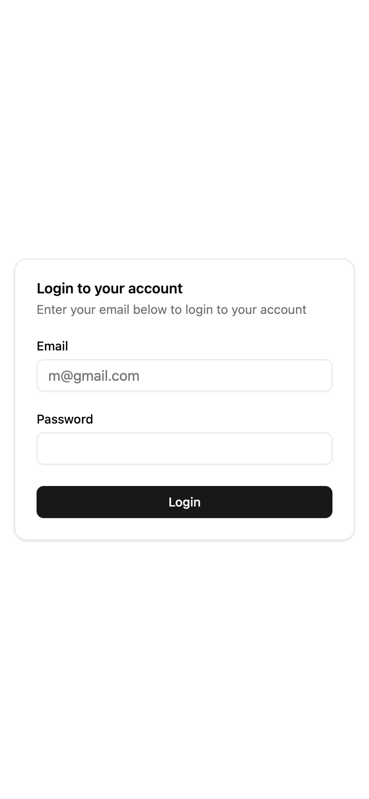
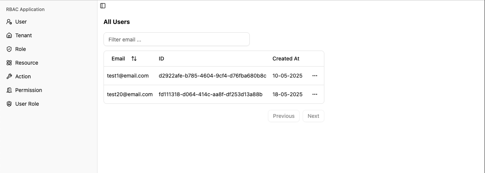
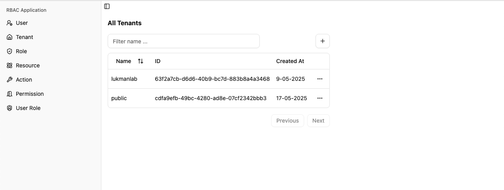
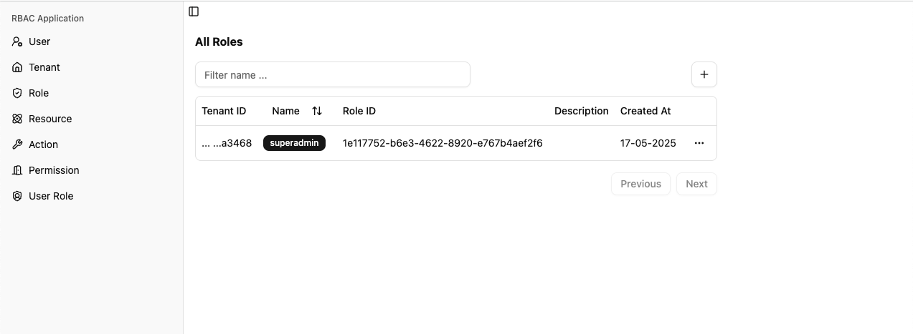
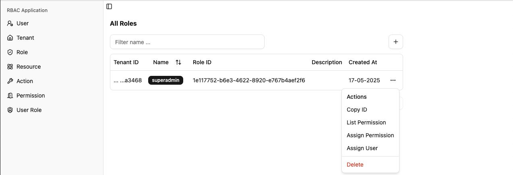
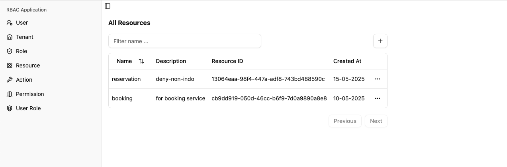
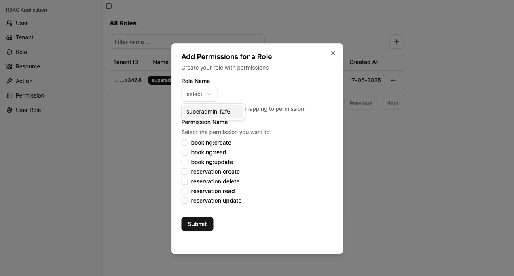
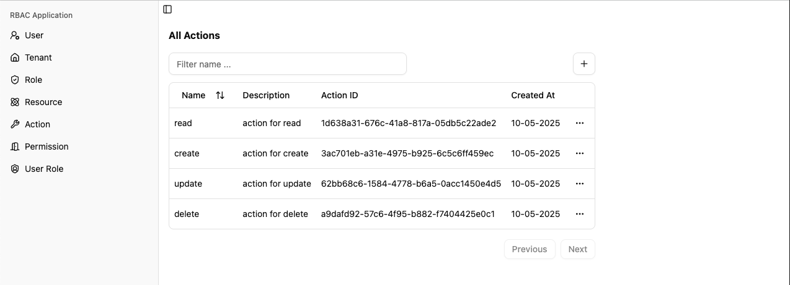
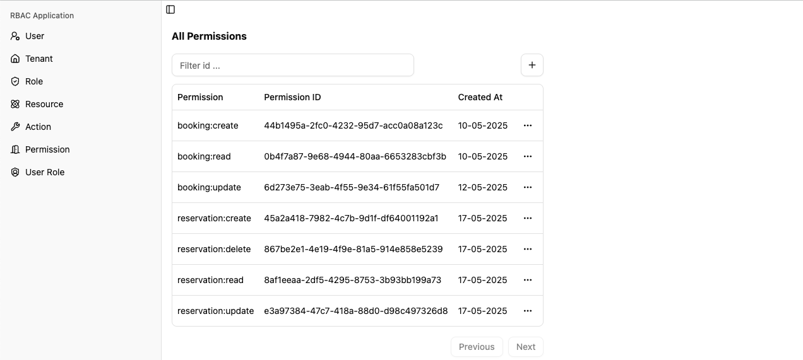
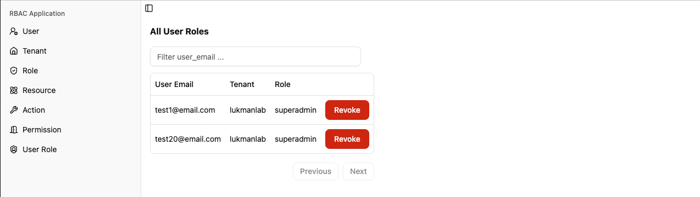

# RBAC Application
Example Role Based Access Control Application, that support multi tenants.

## Library
- Shadcn/ui
- React
- Redux ToolKit (RTK)
- Zod
- etc

## UI - Login User

## UI - List User

## UI - List Tenant

## UI - List Role

## UI - List Resources

## UI - Example Dialog

## UI - List Actions

## UI - List Permissions

## UI - List User Roles

